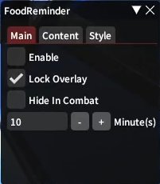

# Food Reminder

[Video Demo](https://github.com/user-attachments/assets/1a96e950-5107-4af8-98ce-80ffbb3bb7fe)

Reminds you to eat food in duties

## Installation

[Custom Plugin Repository](https://gist.githubusercontent.com/sofia819/fb17fff59d39923fde123538dbf8b92b/raw/sofia-plugins.json)

## Notes
- This is filled with bad coding practices and bugs
- This has only been tested on the Global EN version

## Settings

### Main Options
- Enable 
- Lock Overlay
- Hide in Combat
- Remaining Time: how long before reminder

### Content Options
- Level synced only
- All duties
- If all duties option unchecked, the following options are available:
    - Extreme
    - Savage
    - Ultimate

### Style Options
- Primary color
- Secondary color
- Background color
- Flashing effect
- Show icon
- Scale: controls reminder banner size

## Commands

-   `/food`: opens settings
